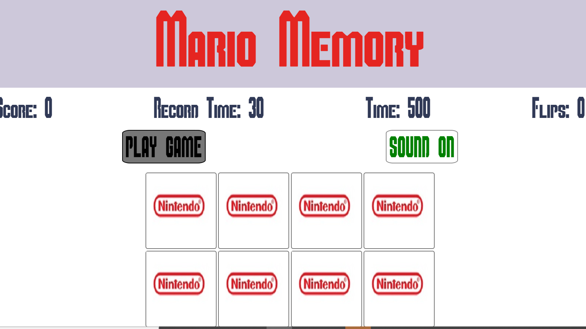

# Memory Mario
Memory Mario is a memory card game set up to transport user's to a world already familiar or one that was familiar a long time ago. Using the main characters from Super Mario and Super Smash bro's, the user's must match up the correct characters with each other in order to complete the game in the specified amount of time of their own choosing. The game has a clear three tier difficulty set up whereby the user can choose to play under a different time parameter which is associated then with the set difficulty of a user's choosing.

## User Stories

- As a user, I want to access a presentable website.
- As a user, I want to play an interactive game that allows me to have fun.
- As a user, I want to be challenged when playing the game.
- As a user, I want to have some way of seeing how 
- I am getting on in the game whilst also keeping an eye on the time limitation
- As a user, I want to be able to access the game on all platforms.
- As a user I want to be able to start and stop the game whenever I choose.
- As a user I want to be able to choose when to turn off and on the music.
- As a user I want to be able to contribute to the overall global leader-board as to challenge me and get myself more focused on getting better.
- As a user I want to hear the game sounds (if I want to) that accompany each click of a card ,match of a pair or incorrect match of a pair as I play the game.
- As an owner I want to facilitate the overall needs of the user.
- As an owner I want to allow users to voluntarily contribute to the overall improvement of the game via a suggestions box.

## UX/UI 

### Landing Page
The emphasis of the game is to mimic the layout of the original Super Mario Bro's gameboy theme. The font was downloaded through a third source to further push the Nintendo feel of the game itself. The landing page is set up in a simple nintendo game fashion whereby options are limited and the game is made abundantly clear. 

Each option is sectioned off in block div elements and has a hover effect added on to them to allow the user a visual represantation of where their cursor is pointed toward. The player can choose to continue on to the start game page which will in turn start the game automatically. If the player wants to have a run down of the game rules, they can do so by pressing the game rules button on the home screen. The rules box was made in a style that would make for easy reading. Black font color on white background, as well as the background of the modal being dimmed to allow the user to zone in on the exact purpose of the game. 

The colours I have decided to utilise for the game include a bright red '#E52521' hex colour, akin to the iconic outfit sported by Mario, '#303956' for the main body writing and '#CDC8DA' for the background color of the main menu and the title behind the heading for the game page. The reason behind the red colour of the title is both self-explanatory and purposeful. The main reason behind it was actually to emphasise it over the backdrop (background-color of #CDC8DA). I felt that it not only served the atmosphere of the game but it also added value in standing out over the light blue sky as seen in the background image. 

### Game Page
The font colour and background colour were chosen in tandem with eachother. After much experimentation in choosing the two colours I decided upon the two as seen as I felt they worked brilliantly to project the game options and the the game heading for the start game page. 

The colors of choosing for the overlays also involved a great deal of deliberation. I wanted to dim the background as much as possible as to communicate to the user that the game had come to a halt (either through victory or loss). For the game over overlay I decided to go with a dark barely translucent background nearly completely black with a slightly bluish font color (#627E9A). As for the victory overlay I decided to adopt more or less the same styles as for the game over lay with the inclusion of a white font for the writing, to differentiate from the font color shown when a loss has occured.

## Features
For this milestone project, I have ran with the idea of inlcuding 4 pages: The Menu screen, the Game screen, the settings screen and the high scores screen. Each screen will be accompanied by the core styles I have decided to use, while also differing in their own respective layouts.

### Menu.html
The Menu screen meets the user and makes them fully aware of the core idea and nature of the website. The backdrop, a tribute to a typical nintendo video game allowing the user to identify with any potential video games they may or may not have encountered throughout their lifetime. The hero image/ title is too written in a nintendo/super mario font-style making the user feel directly acquainted with the nature of the video game. 

Along with the background image and hero title, I have decided to make the dropdown menu/options in a style similiar to that of what a user would typically see in any super mario video game once they have entered the first screen of the game. Each option is given its on block within a bigger grey block to give the sense that they are playing an actual Nintendo Game. Each option will direct the user to a new html page within the website while the heading of each page will direct the user back to the main menu of the website.

### Start-game.html
The main part of the game will be enlisted within the start-game page. The structure of the page will make it very evident as to how the game will be played. The main heading will be at the top of the screen but in a smaller font-size, just to give more importance to the main function of this page. There will  be a game info section, detailing the number of flips, the time left in the game, and the score the player has at any given time throughout the game (each correct match will be rewarded with 10 points). 

The game itself will be a simple card matching memory game, whereby the user has to match up the correct icons with each other in the game until every card within the game section has been matched up. The game will be accompanied by background music, while each correct/incorrect flip will be accompanied by different sounds and alerts. When the game comes to completion, either through the timer running out or the user completing the match up sequence, a text overlay with the title of either "Game over" or "Victory!" will be displayed. This will take up the entire length and width of the screen with a slightly dark background. The user will then have the option to contribute to the high score leaderboard with their own name and score while also having the option to begin the game right over again.

### Overlays

When the player has gone through either process an overlay with either the 'Victory' or 'Game Over' banner will be displayed along with the option to restart/play again. Accompanying each overlay will be the option to post one's own score up to the global leaderboard.

The leaderboard page enlists the top scorers of the game. By including this page to the website users will now have a visual competition upon which to improve their own game in. Using API's allows for a user to contirbute with their own score to the overall leaderboard upon completing the game either through victory (in correctly matching all cards) or through the game ending prematurely (time running out). 

## Bugs

### Flip
One of the biggest issues facing this game is the aspect of flipping cards. There are three scenarios in which the user shouldn't be able to flip a card within the game.
The first major concern around this area is that for the game to function properly, the user should only be allowed to flip two cards in any sequence. This entails that a player shouldn't be able to click at multiple cards in quick succession with each card responding the the flipCard event listener as attached to them from the js.file. To counter act this bug it was therefore tantamount to be able to disable the function upon acting on the rest of the cards array once two cards have been chosen/ only allowing the function to be carried out once more when one card has been chosen. 

A simple way of fixing this issue is to literally lock the board. In doing so we must set up a variable called lock and initially set it to false, at the beginning of the flipCard function we must return the lock as being true so that once this condition is met then the rest of the function will not be carried out. In the incorrectMatch function we can also set the lock variable to true which will then allow the setTimeout function to run it's course of one second, again disabling the flipCard function from being able to be carried out. Once the timeOut has been carried out we can then set the lock variable back to false which will then allow the flipCard function to be able to work yet again. On the flip side, if the two cards matched, a remove event listener was then placed upon the two cards, removing the flip count and flip card functions respectively.

### iOS devices

Upon testing the website on different devices it became apparent that there was an issue with apple devices (iOS software based devices). When the user was attempting to play the game and flip each card, the cards would either glitch in and out of their front and back classes, or the cards would simply flip over revealing an empty card. To get a better understanding of the issue at hand, please see the video attached. [video](https://drive.google.com/file/d/1x20q8UN-MaX6J3W4EFh7cG296om9MLEU/view?usp=sharing).

Ofcourse, this was not ideal. However, upon looking at various articles and sites online it became apparent that this was in fact a very common issue that was occuring for many iOS users. The issue was iOS' handling of transformations and animations from browsers. The solution to this issue was recommended by my mentor through using the site [AutoPrefixer](https://autoprefixer.github.io/). The site was able to parse through the code and added any vendor prefixes as required for different operating systems. 

 
